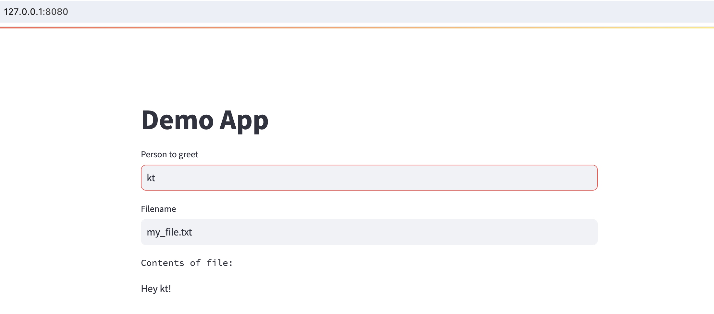

# k8s-demo

## Description

This project contains examples of how to use Helm to deploy a [Job](#job-example) and an 
[App](#app-example) with Kubernetes in the comfort of your own local environment using minikube.

These examples aim to provide an introduction to some common use cases and tips for getting 
started with Kubernetes and Helm. See also [Useful Helm commands](#useful-helm-commands).

- [`k8s`](./k8s): Contains examples to create a PersistentVolume, PersistentVolumeClaim, Job, helper Pod, Service, Deployment
- [`helm`](./helm): Contains Helm charts for app-demo, job-demo
- [`app`](./app): Contains example code to create a Streamlit app

## Prerequistes

- Install [minikube](https://minikube.sigs.k8s.io/docs/start/) `>= 1.x`
- Install [Helm](https://helm.sh/docs/intro/install/)`>= 3.x`
- Optionally install [helm-diff](https://github.com/databus23/helm-diff)

Check installation:
```
which minikube
```

```
which helm
```

## Job Example

This is an example of a Kubernetes job which writes an output to a volume.

### Create storage

The following command will create a PersistentVolume and PersistentVolumeClaim:
```
kubectl apply -f k8s/volume.yaml
```

```
persistentvolume/kt-volume created
persistentvolumeclaim/kt-pvc created
```

Check out what got created:
```
kubectl get pv kt-volume
```

```
kubectl get pvc kt-pvc
```

For more information, check out the [Kubernetes docs](https://kubernetes.io/docs/tasks/configure-pod-container/configure-persistent-volume-storage/) on configuring persistent volume storage.

### Run Job with kubectl

The following will run a Kubernetes job which writes to the volume that was previously created:
```
kubectl apply -f k8s/job.yaml
```

Check it out:
```
kubectl get job job-demo
```

Clean up:
```
kubectl delete job job-demo
```

### Check out the file

We can use a task pod which uses the PersistentVolumeClaim as a volume.
```
kubectl apply -f k8s/task_pv_pod.yaml
```

Get a shell to the container running in the pod:
```
kubectl exec -it task-pv-pod -- /bin/bash
```

Check out the file that the job wrote:
```
cat mnt/data/demo_file.txt
```

Copy the file that was created:
```
kubectl cp task-pv-pod:/mnt/data/demo_file.txt demo_file.txt
```

Clean up:
```
kubectl delete pod task-pv-pod
```

### Run Job with Helm

We can also use Helm to run the same job. This will make our job easier to customize,
such as changing the environment variables, container image, and other job specs.

Install / upgrade `job-demo` Helm chart with default values:
```
helm upgrade job-demo helm/job_demo/ -i
```

Alternatively, install / upgrade `job-demo` Helm chart overriding values from the command line:
```
helm upgrade --set env.filename=new_file.txt job-demo helm/job_demo/ -i
```

Check out the job that got created:
```
kubectl describe job job-demo
```

Clean up the job:
```
kubectl delete job job-demo
```

To check out the file that updated / created, see [Check out the file](#check-out-the-file).

## App Example

This is an example of a Kubernetes Service and Deployment for a Streamlit app,
which builds on the PV and PVC created in the previous section.

### Build

Point your terminal to use the docker daemon inside minikube:
```
eval $(minikube docker-env)
```
Build Docker image:
```
docker build -t kt-app-demo .
```

### Deploy with kubectl

Create the Service and Deployment:
```
kubectl apply -f k8s/service.yaml
```
Check out the resources:
```
kubectl get deployment,service,replicaset -l app=app-demo 
```

### Check out the app

Since we are using `spec.type: ClusterIP`, we will use port forwarding to access
the application in the minikube cluster.
```
kubectl port-forward deployment/app-demo-deployment 8080:8501
```

Head over to [localhost:8080](http://127.0.0.1:8080) to try it out for yourself:



We can interact with the App running in our local cluster in order to write to and read
from a file in the mounted volume. Nice!

Clean up:
```
kubectl delete deployment,services -l app=app-demo 
```

### Deploy App with Helm

We can also use Helm to deploy the Streamlit app. This will make it easier to customize our app,
such as changing the environment variables, container image, and other deployment or service specs.

Install / upgrade `app-demo` Helm chart with default values:
```
helm upgrade app-demo helm/app_demo/ -i
```

Check out the resources that got created:
```
kubectl get deployment,service,replicaset -l app=app-demo
```

To try out the app in your browser, see [Check out the app](#check-out-the-app).

### Useful Helm commands

Below are a few commands that are helpful for working with Helm charts.


Render chart template and display the output:
```
helm template helm/job_demo/ 
```
with `--release-name`
```
helm template --release-name app-demo helm/app_demo
```

Check the chart for possible issues:
```
helm lint helm/job_demo/ 
```

Dry-run chart install / upgrade to check computed values:
```
helm upgrade job-demo helm/job_demo/ -i --dry-run --debug 
```

List releases:
```
helm list
```

```
NAME    	NAMESPACE	REVISION	STATUS  	CHART
job-demo	default  	2       	deployed	job-demo-0.1.0	      
```

Check out everything that was installed with the Helm release:
```
helm get manifest job-demo
```

Check out the history of a Helm release:
```
helm history job-demo
```

Show what changed in two revisions (requires installing helm-diff):
```
helm diff revision job-demo 1 2
```
